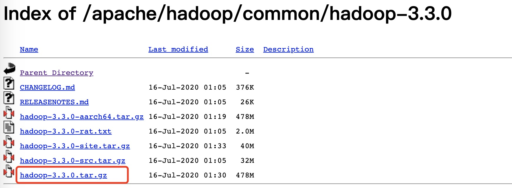
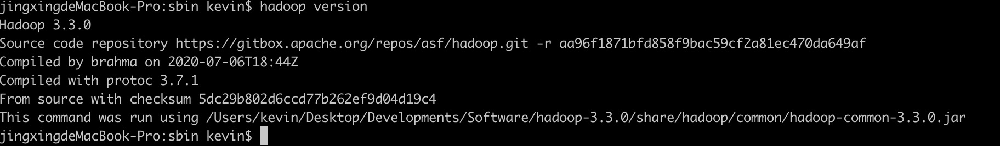
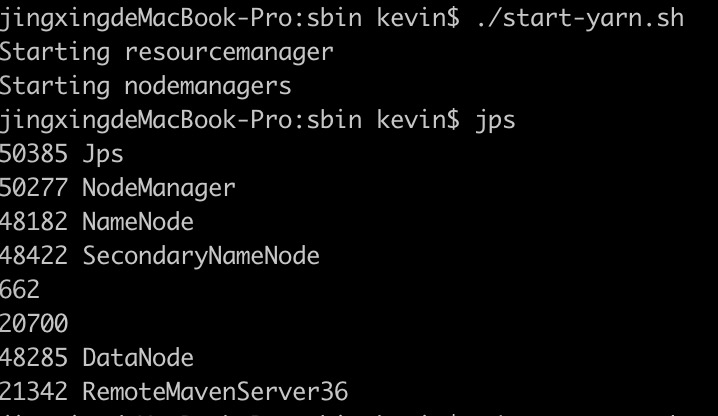
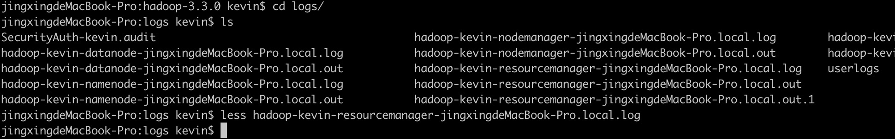
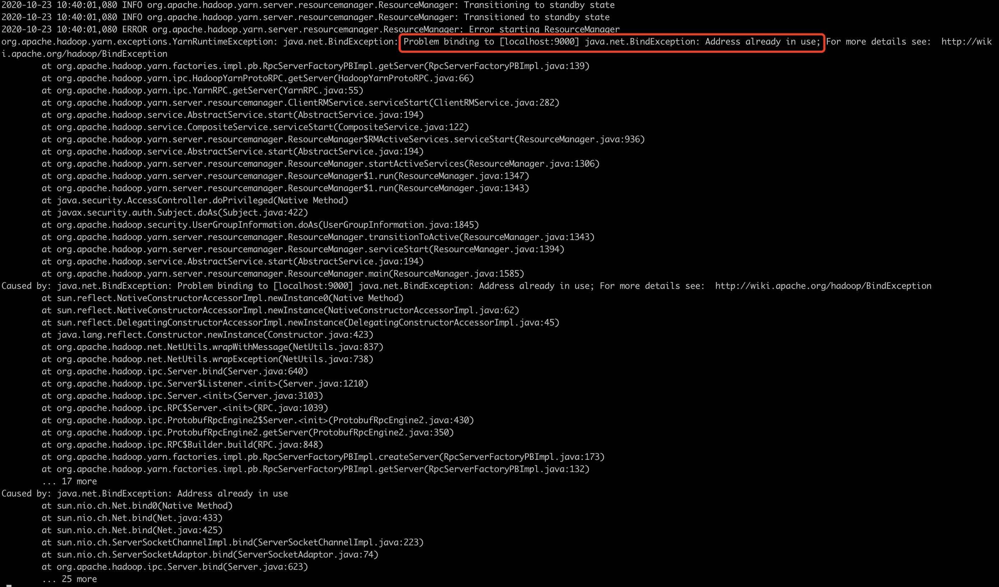
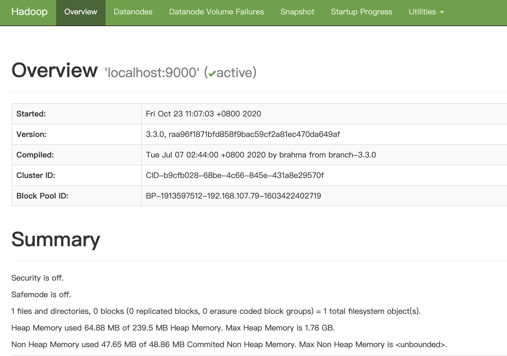

* content
{:toc}

Hadoop是一个开源的分布式文件系统（HDFS）,作为大数据的基础，它是Hive，Saprk,Hbase等数据库、计算引擎的文件系统。

[Elasticsearch Git Repo](https://github.com/elastic/elasticsearch.git)
<!-- more -->

### Hadoop 安装

#### Hadoop 安装包下载

安装的版本，当前的最新版 `hadoop-3.3.0`版本

下载地址[https://mirror.bit.edu.cn/apache/hadoop/common/hadoop-3.3.0/](https://mirror.bit.edu.cn/apache/hadoop/common/hadoop-3.3.0/)

下载完成解压到本地

#### Hadoop 配置环境变量

mac参考[Mac OS X 上搭建 Hadoop 开发环境指南](https://zhuanlan.zhihu.com/p/33117305)

配置好后，执行 `hadoop version`


#### 修改Hadoop配置文件

* hadoop-env.sh
* core-site.xml
* hdfs-site.xml
* mapred-site.xml
* yarn-site.xml

#### 启动NameNode

`hadoop namenode -format`

#### 启动HDFS

进入 sbin目录 `cd /Users/kevin/Desktop/Developments/Software/hadoop-3.3.0/sbin`

启动 `./start-dfs.sh`

如果报错 “connection refused”，解决按照上面的参考

还报错，启动时脚本会 `ssh localhost`, 如果没有设置免密登录就会报连接拒绝，可能还需要如下操作
```java
第一步：ssh-keygen -t rsa 
       然后提示输入直接按回车就好
第二步：cat ~/.ssh/id_rsa.pub >> ~/.ssh/authorized_keys
第三步：chmod og-wx ~/.ssh/authorized_keys
第四步：chmod 750 $HOME 
```

#### 启动Yarn

`./ start-yarn.sh`

`jps` 发现ResourceManager 没有启动

cd到logs目录
`less hadoop-kevin-resourcemanager-jingxingdeMacBook-Pro.local.log`


发现端口9000已经被占用


查看发现端口9001没有被占用`lsof -i:9001`，修改 `yarn-site.xml`将端口改为9001，再次启动发现 resourcemanager启动成功

```shell script
jingxingdeMacBook-Pro:sbin kevin$ ./start-yarn.sh
Starting resourcemanager
Starting nodemanagers
localhost: nodemanager is running as process 50277.  Stop it first.
jingxingdeMacBook-Pro:sbin kevin$ jps
51205 ResourceManager
51349 Jps
50277 NodeManager
48182 NameNode
48422 SecondaryNameNode
662
20700
48285 DataNode
21342 RemoteMavenServer36
jingxingdeMacBook-Pro:sbin kevin$
```

#### 浏览器访问50070端口无法打开

修改`hdfs-site.xml`
```xml
<property>

  <name>dfs.http.address</name>

  <value>0.0.0.0:50070</value>

</property>
```
接下来参考 [https://blog.csdn.net/Neone__u/article/details/53741786](https://blog.csdn.net/Neone__u/article/details/53741786)的步骤，
停掉dfs和yarn，删除hdfs的name和data，重新format namenode，再启动dfs和yarn

#### 安装完成

Yarn管理界面： `http://localhost:8088/cluster`


50070界面：


至此，Hadoop 配置完成