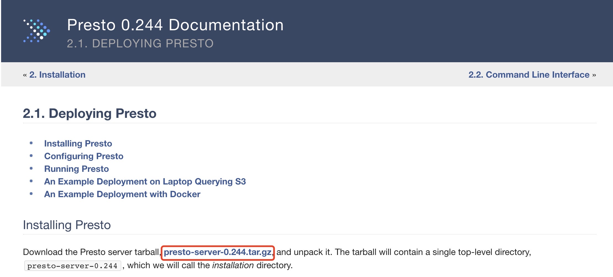
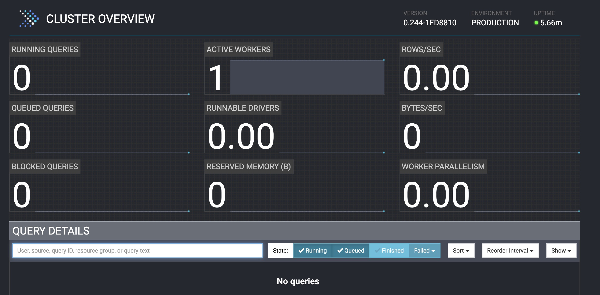
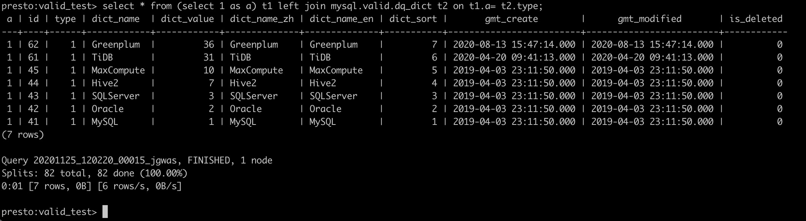
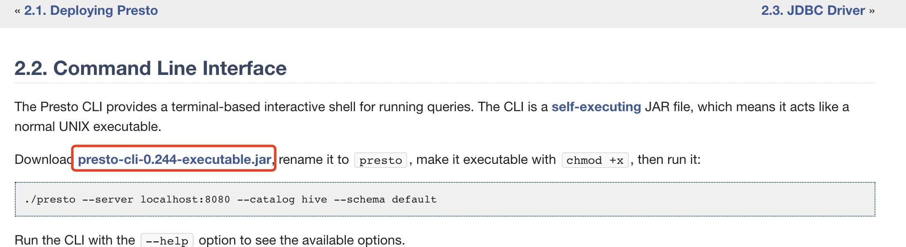

* content
{:toc}


Presto是由 Facebook 推出的一个基于Java开发的开源分布式SQL查询引擎，适用于交互式分析查询，支持跨数据源的级联查询。
Presto本身不存储数据，只有计算能力，支持多种RDBMS和NoSQL。Presto一共有两大分支，一个是 `prestodb`由Facebook维护，一个是 `prestosql`由开源基金会
<!-- more -->


### Presto安装

#### 安装包下载

prestodb下载地址：[https://prestodb.io/docs/current/installation/deployment.html#installing-presto](https://prestodb.io/docs/current/installation/deployment.html#installing-presto)  

另附prestosql下载地址 [https://prestosql.io/download.html](https://prestosql.io/download.html)
当前最新版是 `0.244`



#### 配置Presto

1. 在安装目录内新建 `etc`文件夹，它将用来保存下面的配置

* 节点配置（Node Properties）: environmental configuration specific to each node `etc/node.properties`

>node.environment=production
>node.id=ffffffff-ffff-ffff-ffff-ffffffffffff
>node.data-dir=/var/presto/data

* JVM配置（JVM Config）: command line options for the Java Virtual Machine `etc/jvm.config`

>-server
>-Xmx16G
>-XX:+UseG1GC
>-XX:G1HeapRegionSize=32M
>-XX:+UseGCOverheadLimit
>-XX:+ExplicitGCInvokesConcurrent
>-XX:+HeapDumpOnOutOfMemoryError
>-XX:+ExitOnOutOfMemoryError

* Presto服务器配置（Config Properties）: configuration for the Presto server `etc/config.properties`

>coordinator=true
>node-scheduler.include-coordinator=false
>http-server.http.port=8080
>query.max-memory=50GB
>query.max-memory-per-node=1GB
>query.max-total-memory-per-node=2GB
>discovery-server.enabled=true
>discovery.uri=http://example.net:8080

如果是单台服务器用于测试

>coordinator=true
>node-scheduler.include-coordinator=true
>http-server.http.port=8080
>query.max-memory=5GB
>query.max-memory-per-node=1GB
>query.max-total-memory-per-node=2GB
>discovery-server.enabled=true
>discovery.uri=http://example.net:8080

* Catalog Properties: configuration for Connectors (data sources)，用于配置你要连接的数据源，目录是下 `etc/config/`
如果要配置hive数据源，则在etc/config下创建`hive.properties`

>连接名称
>connector.name=hive-cdh5
># hive元数据连接
>hive.metastore.uri=thrift://cdh1:9083
># hive配置文件，core-site.xml, hdfs-site.xml
>hive.config.resources=/etc/hadoop/conf/core-site.xml,/etc/hadoop/conf/hdfs-site.xml

### Presto运行

运行 /bin/launcher start报错
```shell script
jingxingdeMacBook-Pro:bin kevin$ launcher start
ERROR: JVM config file is missing: /Users/kevin/Desktop/Developments/Software/presto-server-0.244/etc/jvm.config
```

原因： `jvm.config`文件名不正确，修改文件名

```shell script
jingxingdeMacBook-Pro:etc kevin$ ls -lt
total 32
-rw-r--r--@ 1 kevin  staff  141 11 25 16:52 node.properties
-rw-r--r--@ 1 kevin  staff  236 11 25 16:50 config.properties
-rw-r--r--@ 1 kevin  staff   24 11 25 16:47 log.properties
-rw-r--r--@ 1 kevin  staff  170 11 25 16:46 jvm.config.txt
drwxr-xr-x  4 kevin  staff  128 11 25 16:44 catalog
jingxingdeMacBook-Pro:etc kevin$ mv jvm.config.txt jvm.config
```


再次执行
```shell script
jingxingdeMacBook-Pro:bin kevin$ launcher start
Started as 693
```

查看 `presto-data`下 `var/log/server.log`日志，Presto运行成功

```shell script
2020-11-25T17:06:16.386+0800	INFO	main	Bootstrap	PROPERTY         DEFAULT  RUNTIME  DESCRIPTION
2020-11-25T17:06:16.386+0800	INFO	main	Bootstrap	jmx.dump-period  10.00s   10.00s
2020-11-25T17:06:16.386+0800	INFO	main	Bootstrap	jmx.dump-tables  []       []
2020-11-25T17:06:16.386+0800	INFO	main	Bootstrap	jmx.max-entries  86400    86400
2020-11-25T17:06:16.708+0800	INFO	main	com.facebook.presto.metadata.StaticCatalogStore	-- Added catalog jmx using connector jmx --
2020-11-25T17:06:16.726+0800	INFO	main	com.facebook.presto.security.AccessControlManager	-- Loading system access control --
2020-11-25T17:06:16.727+0800	INFO	main	com.facebook.presto.security.AccessControlManager	-- Loaded system access control allow-all --
2020-11-25T17:06:16.727+0800	INFO	main	com.facebook.presto.spiller.TempStorageManager	-- Loading temp storage --
2020-11-25T17:06:16.730+0800	INFO	main	com.facebook.presto.spiller.TempStorageManager	-- Loaded temp storage local --
2020-11-25T17:06:16.754+0800	INFO	main	com.facebook.presto.server.PrestoServer	======== SERVER STARTED ========
```


停止Presto
```shell script
jingxingdeMacBook-Pro:bin kevin$ launcher stop
Stopped 693
```

##### 访问presto ui

浏览器访问 http://prestoip:port, 我安装在本地，访问 localhost:8080



#### 问题

添加hive数据源后报错：
```shell script
2020-11-25T17:26:36.429+0800	ERROR	main	com.facebook.presto.server.PrestoServer	No factory for connector hive2
java.lang.IllegalArgumentException: No factory for connector hive2
	at com.google.common.base.Preconditions.checkArgument(Preconditions.java:216)
	at com.facebook.presto.connector.ConnectorManager.createConnection(ConnectorManager.java:208)
	at com.facebook.presto.metadata.StaticCatalogStore.loadCatalog(StaticCatalogStore.java:123)
	at com.facebook.presto.metadata.StaticCatalogStore.loadCatalog(StaticCatalogStore.java:98)
	at com.facebook.presto.metadata.StaticCatalogStore.loadCatalogs(StaticCatalogStore.java:80)
	at com.facebook.presto.metadata.StaticCatalogStore.loadCatalogs(StaticCatalogStore.java:68)
	at com.facebook.presto.server.PrestoServer.run(PrestoServer.java:138)
	at com.facebook.presto.server.PrestoServer.main(PrestoServer.java:79)
```

**原因：** `connector.name`的名字是有要求的，什么数据源就是什么名字，我的hive是Hadoop2的， 名字就是 `hive-hadoop2`
```shell script
jingxingdeMacBook-Pro:plugin kevin$ ls
accumulo			hive-hadoop2			ml				postgresql			redshift			tpch
atop				jmx				mongodb				presto-druid			resource-group-managers
blackhole			kafka				mysql				presto-elasticsearch		session-property-managers
cassandra			kudu				oracle				presto-thrift			sqlserver
example-http			localfile			password-authenticators		raptor				teradata-functions
geospatial			memory				pinot				redis				tpcds
```

[https://prestosql.io/docs/current/connector/hive.html](https://prestosql.io/docs/current/connector/hive.html)

### 使用presto-cli访问presto

下载 `presto-cli-0.244-executable.jar`并重命名为 `presto`, 修改presto为可执行文件 `chmod -x presto`， 使用如下命令执行，其中 catalog指定数据源，schema指定数据库
```shell script
./presto --server localhost:8080 --catalog hive --schema default
```

**问题：** hive数据源查询不到数据，也查询不到表信息。 原因是这里的hive需要配置成hive metastore的端口（默认9083）而非hiveserver的端口.
```shell script
jingxingdeMacBook-Pro:bin kevin$ ./presto --server localhost:8080 --catalog hive --schema default

presto:default> show tables;
Query 20201125_095411_00003_mi2zd failed: Failed connecting to Hive metastore: [172.16.101.227:10000]

presto:default> select 1;
 _col0
-------
     1
(1 row)
```

#### 使用presto实现跨源查询

现在catalog里配置了两个数据源，一个hive一个MySQL，如何实现跨数据源的SQL查询呢？其实写法和普通的关联查询类似，如果是关联其他源的表，需要在表名前
指定上**数据源名称**、**Schema(库)名称**。 例：hive关联查询MySQL数据库valid_test.dq_dict

```sql
select * from (select 1 as a) t1 left join mysql.valid.dq_dict t2 on t1.a= t2.type;
```


下载地址 [https://prestodb.io/docs/current/installation/cli.html](https://prestodb.io/docs/current/installation/cli.html)




#### 配置MySQL连接

在 `etc/catalog`下新建 `mysql.properties`

```properties
connector.name=mysql
connection-url=jdbc:mysql://172.16.100.115:3306
connection-user=drpeco
connection-password=DT@Stack#123
```

#### 问题

启动报错:
```shell script
Caused by: java.lang.IllegalArgumentException: Database (catalog) must not be specified in JDBC URL for MySQL connector
	at com.google.common.base.Preconditions.checkArgument(Preconditions.java:141)
	at com.facebook.presto.plugin.mysql.MySqlClientModule.ensureCatalogIsEmpty(MySqlClientModule.java:46)
	at com.facebook.presto.plugin.mysql.MySqlClientModule.setup(MySqlClientModule.java:36)
	at com.facebook.airlift.configuration.AbstractConfigurationAwareModule.configure(AbstractConfigurationAwareModule.java:43)
	at com.google.inject.spi.Elements$RecordingBinder.install(Elements.java:344)
	at com.google.inject.spi.Elements.getElements(Elements.java:103)
	at com.google.inject.internal.InjectorShell$Builder.build(InjectorShell.java:137)
	at com.google.inject.internal.InternalInjectorCreator.build(InternalInjectorCreator.java:103)
	... 13 more
```

##### 原因：

不能把url配置成jdbc的格式，这里只需要配置 `jdbc:mysql://172.16.100.115:3306`即可
```properties
connection-url=jdbc:mysql://172.16.100.115:3306/dt_assets?serverTimezone=UTC&characterEncoding=UTF-8&useSSL=false
```
