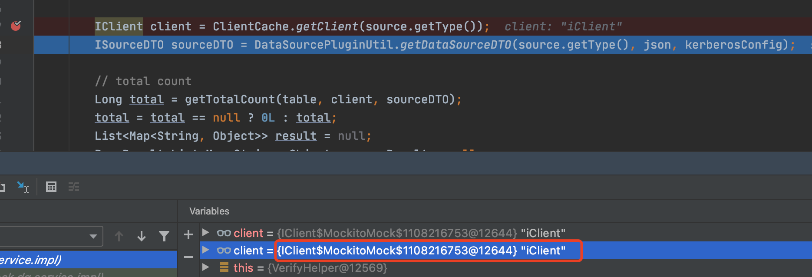
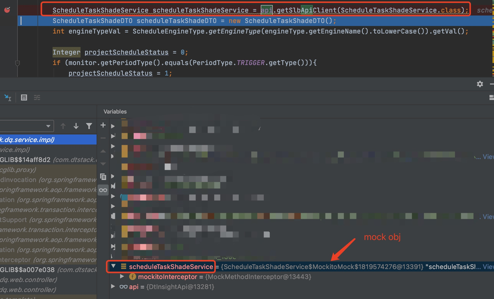

* content
{:toc}

使用Mockito作为项目的单元测试mock框架
<!-- more -->


#### 基础介绍：
**Mock 测试**：对于测试中不方便测试的方法、对象，使用一个虚拟对象代替来进行测试。
##### 使用场景：
1. http远程调用接口；
2. 数据源插件化
3. 定时任务
**TDD：** test driven design（测试驱动开发）
**Mockito:** 一个开源的模拟测试框架，可以帮助你创建优美、简洁的单元测试，mockito既可以mock普通方法又可以mock静态方法，还可以mock依赖注入。
**Mockito 官网：**[https://site.mockito.org/](https://site.mockito.org/)
### 如何使用：
1. **pom.xml**  中添加上mockito的依赖
```xml
<dependency>
    <groupId>org.mockito</groupId>
    <artifactId>mockito-core</artifactId>
    <version>3.4.6</version>
    <scope>test</scope>
</dependency>
<dependency>
    <groupId>org.mockito</groupId>
    <artifactId>mockito-inline</artifactId>
    <scope>test</scope>
</dependency>
```
2. 编写单元测试
注入静态方法, 使用 @Mock 将 IClient 注入进来，并使用 Mockito.when(obj.method()).thenReturn(result) 返回想要mock的方法的结果。
```java
public class Test{
    // 2. @Mock 注入mock对象iClient
    @Mock
    private IClient iClient;
    private static MockedStatic<ClientCache> clientCache;
    @BeforeClass
    public static void init() {
        // Mock static method
        // 1. mock静态类 ClientCache
        clientCache = Mockito.mockStatic(ClientCache.class);
    }
    @Before
    public void setUp() {
        // open mock， 开启mock
        MockitoAnnotations.openMocks(this);
        // 3. mock ClientCache.getClient()方法，当遇到这个方法时，返回 iClient对象
        clientCache.when(() -> ClientCache.getClient(Mockito.anyInt())).thenReturn(iClient);
    }
    @Test
    public void testCheckConnection() throws Exception {
        CheckConnectionParam param = new CheckConnectionParam();
        param.setDataDesc("数据质量v4.0.0");
        param.setDataName("valid_400");
        param.setType(1);
        // 4.使用：mock iClient.testCon()方法并返回true
        Mockito.when(iClient.testCon(any(ISourceDTO.class))).thenReturn(true);
        Boolean aBoolean = dataSourceService.checkConnection(param);
        Assert.assertTrue(aBoolean);
    }
}
```
使用 @Spy 注入Spring容器中的实例，使用 @Spy 注入对象，使用 Mockito.doReturn(result).when(obj).method() 返回想要mock的方法的结果。
```java
public class TestSpy{
    
    @Mock
    private IClient iClient;
    
    @Spy
    private MonitorService monitorService;
    private static MockedStatic<ClientCache> clientCache;
    @BeforeClass
    public static void init() {
        // Mock static method
        clientCache = Mockito.mockStatic(ClientCache.class);
    }
    @Before
    public void setUp() throws Exception {
        // open mock
        MockitoAnnotations.openMocks(this);
        // @Spy - mock autowired object
        Mockito.doReturn(null).when(monitorService).fillKerberosConfig(Mockito.anyLong());
    }
    
    public Map<String, Object> fillKerberosConfig(Long sourceId) {
        DataSource source = dataSourceDao.getOne4Job(sourceId);
        Long dtuicTenantId = tenantDao.getOne(source.getTenantId()).getDtuicTenantId();
        return fillKerberosConfig(source, dtuicTenantId);
    }
    
}
```
Mockito生成的mock对象：


### Q&A:
1. `@Mock` 与 `@Spy` 的区别： @Mock 会创建一个虚拟对象，不会去调用真实的方法（被mock的方法）
而 @Spy 则是创建一个真实的对象，如果通过 `when(...)thenReturn(...)` 会调用真实方法，只不过会返回虚拟对象，通过  `doReturn(...).when(...)` 则不会执行真实方法。
2. 在mock Spring容器中的对象时为何要使用 @Spy : Spring的对象注入时并没有重新创建对象，而@Mock 没有创建真实对象，所以使用 @Mock 会报空指针，这里就需要使用 @Spy 来创建真实对象。
3. mock对象的方法时，参数如何指定：如果是对应任意的值，则只需使用 Mockito.any...() 来模拟即可，如果是对象，还可以指定为class对象，如 Mockito.any(SqlQueryDTO.class) 
 
### 常见问题（排坑）：
1. 前面mock对象的方法时使用 `Mockito.any...()` 但是没有生效：如果传参是null，参数就不能再使用any了，需要使用比较方法 eq(null) ,如下：
```java
import static org.mockito.ArgumentMatchers.any;
import static org.mockito.ArgumentMatchers.eq;
@Test
public void testCreateDirtyTable() throws Exception {
    Mockito.when(iClient.executeSqlWithoutResultSet(eq(null),any(SqlQueryDTO.class))).thenReturn(true);
    MonitorRecord monitorRecord = BaseObject.getMonitorRecord();
    baseSqlOperator.createDirtyTable(iClient, null, BaseObject.DIRTY_TABLE_NAME, DataBaseType.MaxCompute, monitorRecord);
}
```
2. 使用 `@Mock` 模拟Spring的依赖注入报NPE：改用 `@Spy` 注解

3. 初始化`@Spy`对象失败报错
```java
org.mockito.exceptions.base.MockitoException: 
Failed to release mocks

This should not happen unless you are using a third-part mock maker

	at org.springframework.boot.test.mock.mockito.MockitoTestExecutionListener.initMocks(MockitoTestExecutionListener.java:68)
	at org.springframework.boot.test.mock.mockito.MockitoTestExecutionListener.prepareTestInstance(MockitoTestExecutionListener.java:53)
	at org.springframework.test.context.TestContextManager.prepareTestInstance(TestContextManager.java:244)
	at org.springframework.test.context.junit4.SpringJUnit4ClassRunner.createTest(SpringJUnit4ClassRunner.java:227)
	at org.springframework.test.context.junit4.SpringJUnit4ClassRunner$1.runReflectiveCall(SpringJUnit4ClassRunner.java:289)
	at org.junit.internal.runners.model.ReflectiveCallable.run(ReflectiveCallable.java:12)
	at org.springframework.test.context.junit4.SpringJUnit4ClassRunner.methodBlock(SpringJUnit4ClassRunner.java:291)
	at org.springframework.test.context.junit4.SpringJUnit4ClassRunner.runChild(SpringJUnit4ClassRunner.java:246)
	at org.springframework.test.context.junit4.SpringJUnit4ClassRunner.runChild(SpringJUnit4ClassRunner.java:97)
	at org.junit.runners.ParentRunner$4.run(ParentRunner.java:331)
	at org.junit.runners.ParentRunner$1.schedule(ParentRunner.java:79)
	at org.junit.runners.ParentRunner.runChildren(ParentRunner.java:329)
	at org.junit.runners.ParentRunner.access$100(ParentRunner.java:66)
	at org.junit.runners.ParentRunner$2.evaluate(ParentRunner.java:293)
	at org.junit.internal.runners.statements.RunBefores.evaluate(RunBefores.java:26)
	at org.springframework.test.context.junit4.statements.RunBeforeTestClassCallbacks.evaluate(RunBeforeTestClassCallbacks.java:61)
	at org.junit.internal.runners.statements.RunAfters.evaluate(RunAfters.java:27)
	at org.springframework.test.context.junit4.statements.RunAfterTestClassCallbacks.evaluate(RunAfterTestClassCallbacks.java:70)
	at org.junit.runners.ParentRunner$3.evaluate(ParentRunner.java:306)
	at org.junit.runners.ParentRunner.run(ParentRunner.java:413)
	at org.springframework.test.context.junit4.SpringJUnit4ClassRunner.run(SpringJUnit4ClassRunner.java:190)
	at org.junit.runner.JUnitCore.run(JUnitCore.java:137)
	at com.intellij.junit4.JUnit4IdeaTestRunner.startRunnerWithArgs(JUnit4IdeaTestRunner.java:68)
	at com.intellij.rt.junit.IdeaTestRunner$Repeater.startRunnerWithArgs(IdeaTestRunner.java:33)
	at com.intellij.rt.junit.JUnitStarter.prepareStreamsAndStart(JUnitStarter.java:230)
	at com.intellij.rt.junit.JUnitStarter.main(JUnitStarter.java:58)
Caused by: org.mockito.exceptions.base.MockitoException: Unable to initialize @Spy annotated field 'api'.
Please ensure that the type 'DtInsightApi' has a no-arg constructor.
	... 26 more
Caused by: org.mockito.exceptions.base.MockitoException: Please ensure that the type 'DtInsightApi' has a no-arg constructor.
	... 26 more
```

**原因：** `DtInsightApi`没有public的无参构造,导致Mockito 无法生成代理类。

相关问题：[https://stackoverflow.com/questions/65407559/mockito-how-to-mock-spring-special-di-that-the-injected-object-doesnt-have-no?noredirect=1#comment115649529_65407559](https://stackoverflow.com/questions/65407559/mockito-how-to-mock-spring-special-di-that-the-injected-object-doesnt-have-no?noredirect=1#comment115649529_65407559)

**解决方案：** 试了很多方法无法成功后，开始查阅Spring官方文档[https://docs.spring.io/spring-boot/docs/1.5.2.RELEASE/reference/html/boot-features-testing.html](https://docs.spring.io/spring-boot/docs/1.5.2.RELEASE/reference/html/boot-features-testing.html)，
在文档中发现Spring提供了 `@MockBean`来mock `ApplicationContext`中的bean，正好符合我现在的要求。

官方描述如下：

**41.3.4 Mocking and spying beans**
>It’s sometimes necessary to mock certain components within your application context when running tests. For example, 
>you may have a facade over some remote service that’s unavailable during development. Mocking can also be useful when 
>you want to simulate failures that might be hard to trigger in a real environment.
>
>Spring Boot includes a `@MockBean` annotation that can be used to define a Mockito mock for a bean inside your `ApplicationContext`. 
>You can use the annotation to add new beans, or replace a single existing bean definition. The annotation can be used directly on test classes, 
>on fields within your test, or on `@Configuration` classes and fields. When used on a field, the instance of the created mock will also be injected. 
>Mock beans are automatically reset after each test method.
>
>Here’s a typical example where we replace an existing `RemoteService` bean with a mock implementation:

官方例子：`RemoteService`是Spring容器中的一个bean，现在需要mock它
1. 使用 `@MockBean`
2. 使用 `given(this.remoteService.someCall()).willReturn("mock");`方式mock

```java
import org.junit.*;
import org.junit.runner.*;
import org.springframework.beans.factory.annotation.*;
import org.springframework.boot.test.context.*;
import org.springframework.boot.test.mock.mockito.*;
import org.springframework.test.context.junit4.*;

import static org.assertj.core.api.Assertions.*;
import static org.mockito.BDDMockito.*;

@RunWith(SpringRunner.class)
@SpringBootTest
public class MyTests {

    @MockBean
    private RemoteService remoteService;

    @Autowired
    private Reverser reverser;

    @Test
    public void exampleTest() {
        // RemoteService has been injected into the reverser bean
        given(this.remoteService.someCall()).willReturn("mock");
        String reverse = reverser.reverseSomeCall();
        assertThat(reverse).isEqualTo("kcom");
    }

}
```

**我的修改：** 使用 `@MockBean` 和 `BDDMockito.given(...).willReturn(...)`
```java
public class Test{
    @MockBean
    @Qualifier("api")
    private DtInsightApi api;

    @Before
    public void setUp() throws Exception {
        // open mock
        MockitoAnnotations.openMocks(this);
        BDDMockito.given(this.api.getSlbApiClient(ScheduleTaskShadeService.class)).willReturn(scheduleTaskShadeService);
    }
}
```

Debug 创建mockService实例的代码,可以发现 `ScheduleTaskShadeService` 是被 Mockito代理的对象。




