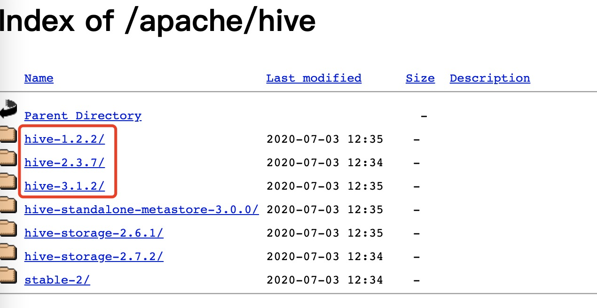
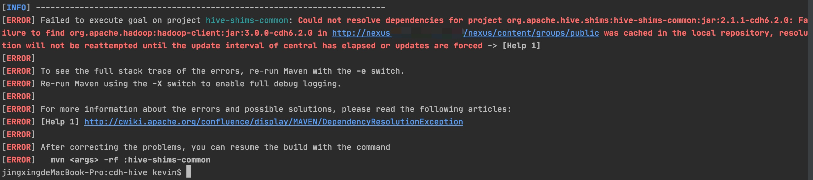
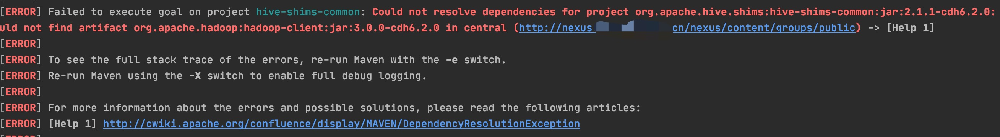

* content
{:toc}


Hive 安装
<!-- more -->

### Hive 安装

#### 下载安装包

Hive 官方入门指南：[https://cwiki.apache.org/confluence/display/Hive/GettingStarted](https://cwiki.apache.org/confluence/display/Hive/GettingStarted)

1. 下载安装包
官方稳定版下载地址 [https://mirrors.tuna.tsinghua.edu.cn/apache/hive/](https://mirrors.tuna.tsinghua.edu.cn/apache/hive/)

当前的最新稳定版本为： `hive-1.2.2` `hive-2.3.7` `hive-3.1.2`

2. 下载源码编译 hive-cdh 2.1.1版本
git 地址：[https://github.com/cloudera/hive/tree/cdh6.2.0](https://github.com/cloudera/hive/tree/cdh6.2.0)

* 编译 `mvn clean package -Pdist -DskipTests`
报错：

使用 ` mvn clean package -Pdist -DskipTests -U`后报

查看cloudera maven仓库[ https://repository.cloudera.com/content/repositories/snapshots/org/apache/hadoop/hadoop-client/3.0.0-cdh6.2.0/hadoop-client-3.0.0-cdh6.2.0.jar
]( https://repository.cloudera.com/content/repositories/snapshots/org/apache/hadoop/hadoop-client/3.0.0-cdh6.2.0/hadoop-client-3.0.0-cdh6.2.0.jar
) 发现根本就没有此jar（hadoop-client-3.0.0-cdh6.2.0.jar）包


现在只能使用安装包安装了，以 `2.3.7`版本为例

* 解压压缩包
* 设置环境变量 `sudo vi ~/.bash_profile`

```shell script
export HIVE_HOME=/Users/kevin/Desktop/Developments/Software/apache-hive-2.3.7-bin
PATH=$HIVE_HOME/bin:$PATH:.
export PATH
```
让配置生效 `source ~/.bash_profile`

这时候运行hive报错

```shell script
$HIVE_HOME/bin/hive
```

```shell script
jingxingdeMacBook-Pro:bin kevin$ hive
SLF4J: Class path contains multiple SLF4J bindings.
SLF4J: Found binding in [jar:file:/Users/kevin/Desktop/Developments/Software/apache-hive-2.3.7-bin/lib/log4j-slf4j-impl-2.6.2.jar!/org/slf4j/impl/StaticLoggerBinder.class]
SLF4J: Found binding in [jar:file:/Users/kevin/Desktop/Developments/Software/hadoop-3.3.0/share/hadoop/common/lib/slf4j-log4j12-1.7.25.jar!/org/slf4j/impl/StaticLoggerBinder.class]
SLF4J: See http://www.slf4j.org/codes.html#multiple_bindings for an explanation.
SLF4J: Actual binding is of type [org.apache.logging.slf4j.Log4jLoggerFactory]
Exception in thread "main" java.lang.NoSuchMethodError: com.google.common.base.Preconditions.checkArgument(ZLjava/lang/String;Ljava/lang/Object;)V
	at org.apache.hadoop.conf.Configuration.set(Configuration.java:1380)
	at org.apache.hadoop.conf.Configuration.set(Configuration.java:1361)
	at org.apache.hadoop.mapred.JobConf.setJar(JobConf.java:536)
	at org.apache.hadoop.mapred.JobConf.setJarByClass(JobConf.java:554)
	at org.apache.hadoop.mapred.JobConf.<init>(JobConf.java:448)
	at org.apache.hadoop.hive.conf.HiveConf.initialize(HiveConf.java:4045)
	at org.apache.hadoop.hive.conf.HiveConf.<init>(HiveConf.java:4003)
	at org.apache.hadoop.hive.common.LogUtils.initHiveLog4jCommon(LogUtils.java:81)
	at org.apache.hadoop.hive.common.LogUtils.initHiveLog4j(LogUtils.java:65)
	at org.apache.hadoop.hive.cli.CliDriver.run(CliDriver.java:702)
	at org.apache.hadoop.hive.cli.CliDriver.main(CliDriver.java:686)
	at sun.reflect.NativeMethodAccessorImpl.invoke0(Native Method)
	at sun.reflect.NativeMethodAccessorImpl.invoke(NativeMethodAccessorImpl.java:62)
	at sun.reflect.DelegatingMethodAccessorImpl.invoke(DelegatingMethodAccessorImpl.java:43)
	at java.lang.reflect.Method.invoke(Method.java:498)
	at org.apache.hadoop.util.RunJar.run(RunJar.java:323)
	at org.apache.hadoop.util.RunJar.main(RunJar.java:236)
```

**原因：** hadoop与hive依赖了相同的jar包，并且版本不一致。hive中的guava是`guava-14.0.1.jar`，而Hadoop的依赖是`guava-27.0-jre.jar`
**处理：** 删除其中一个jar包，删除版本较低的，保留高版本的jar

```shell script
 rm /{hive dir}/apache-hive-2.3.7-bin/lib/guava-19.0.jar
 cp /{hadoop dir}/hadoop-3.3.0/share/hadoop/hdfs/lib/guava-27.0-jre.jar /{hive dir}/apache-hive-2.3.7-bin/lib/
```
**注意** hadoop jar包位置在 `hadoop-3.3.0/share/hadoop/hdfs/lib` 下。

参考问题： [https://issues.apache.org/jira/browse/HIVE-22915](https://issues.apache.org/jira/browse/HIVE-22915)

再次启动hive 运行成功，但是此时还没有配置hive的metastore。启动hive前需要确保你启动了Hadoop，否则报错
```shell script
jingxingdeMacBook-Pro:apache-hive-2.3.7-bin kevin$ $HIVE_HOME/bin/hive
SLF4J: Class path contains multiple SLF4J bindings.
SLF4J: Found binding in [jar:file:/Users/kevin/Desktop/Developments/Software/apache-hive-2.3.7-bin/lib/log4j-slf4j-impl-2.6.2.jar!/org/slf4j/impl/StaticLoggerBinder.class]
SLF4J: Found binding in [jar:file:/Users/kevin/Desktop/Developments/Software/hadoop-3.3.0/share/hadoop/common/lib/slf4j-log4j12-1.7.25.jar!/org/slf4j/impl/StaticLoggerBinder.class]
SLF4J: See http://www.slf4j.org/codes.html#multiple_bindings for an explanation.
SLF4J: Actual binding is of type [org.apache.logging.slf4j.Log4jLoggerFactory]

Logging initialized using configuration in jar:file:/Users/kevin/Desktop/Developments/Software/apache-hive-2.3.7-bin/lib/hive-common-2.3.7.jar!/hive-log4j2.properties Async: true
Hive-on-MR is deprecated in Hive 2 and may not be available in the future versions. Consider using a different execution engine (i.e. spark, tez) or using Hive 1.X releases.
hive> show tables;
FAILED: SemanticException org.apache.hadoop.hive.ql.metadata.HiveException: java.lang.RuntimeException: Unable to instantiate org.apache.hadoop.hive.ql.metadata.SessionHiveMetaStoreClient
hive>
```

只启动hive不启动Hadoop报错：
```shell script
Logging initialized using configuration in jar:file:/Users/kevin/Desktop/Developments/Software/apache-hive-2.3.7-bin/lib/hive-common-2.3.7.jar!/hive-log4j2.properties Async: true
Exception in thread "main" java.lang.RuntimeException: java.net.ConnectException: Call From jingxingdeMacBook-Pro.local/192.168.106.171 to localhost:9000 failed on connection exception: java.net.ConnectException: Connection refused; For more details see:  http://wiki.apache.org/hadoop/ConnectionRefused
	at org.apache.hadoop.hive.ql.session.SessionState.start(SessionState.java:610)
	at org.apache.hadoop.hive.ql.session.SessionState.beginStart(SessionState.java:553)
	at org.apache.hadoop.hive.cli.CliDriver.run(CliDriver.java:750)
	at org.apache.hadoop.hive.cli.CliDriver.main(CliDriver.java:686)
	at sun.reflect.NativeMethodAccessorImpl.invoke0(Native Method)
	at sun.reflect.NativeMethodAccessorImpl.invoke(NativeMethodAccessorImpl.java:62)
	at sun.reflect.DelegatingMethodAccessorImpl.invoke(DelegatingMethodAccessorImpl.java:43)
	at java.lang.reflect.Method.invoke(Method.java:498)
	at org.apache.hadoop.util.RunJar.run(RunJar.java:323)
	at org.apache.hadoop.util.RunJar.main(RunJar.java:236)
Caused by: java.net.ConnectException: Call From jingxingdeMacBook-Pro.local/192.168.106.171 to localhost:9000 failed on connection exception: java.net.ConnectException: Connection refused; For more details see:  http://wiki.apache.org/hadoop/ConnectionRefused
```