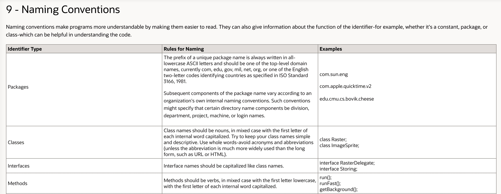

* content
{:toc}

Java 类方法命名规范

[https://www.oracle.com/java/technologies/javase/codeconventions-introduction.html](https://www.oracle.com/java/technologies/javase/codeconventions-introduction.html)

<!-- more -->

# 介绍

记录Java类和方法的命名规范，达到见名思意的目的。

## 类名规范

以下内容复制自: [https://blog.csdn.net/sinat_22840937/article/details/78542520](https://blog.csdn.net/sinat_22840937/article/details/78542520)

#### 获取器/查询器

>Getter  
>Finder  
>Accessor  

#### 验证器/比较器

>Checker  
>Matcher  
>Validator  
>Comparator  
>Sorter  

#### 修改器/编辑器

>Modifier  
>Updater  
>Adjuster  
>Editor  

#### 发送器/接收器
>Emitter  
>Sender/Receiver  
>Broadcaster/Multicaster  

#### 访问器/迭代器

>Visitor  
>Iterator  

#### 生命周期相关
>Loader  
>Parser  
>Constructor/Maker/Creator/Generator  
>Initializer  
>Register  
>Activator  
>Starter  
>Stopper  
>Destroyer  

#### 事件相关
>Listener  
>Producer/Consumer  
>Observer/Observable  
>Timer  
  
#### 封装/容纳  
>Adapter  
>Wrapper  
>Container  
>Server  
 
#### 过滤器/拦截器  
>Filter  
>Interceptor  
 
#### 用户角色相关  
>Signer  
>Owner  
>User  
>Member  
>Operator  
>Authenticator  

#### 代理类  
>Proxy  
>Broker  
>Delegate  
>Gateway  

#### 监控\跟踪\探查器  
>Detector  
>Profiler  
>Monitor  
>Tracker  
>Introspector    

#### 多线程相关
>Synchronizer  
>Blocker  
>Holder  
>Worker  

#### 辅助类/工具类
>Helper  
>Supporter  
>Util  
>Utility  
>Kit  
>Tool  
>Toolkit  

#### 创建/生成器
>Maker  
>Creator  
>Generator  
>Constructor  
>Builder  
>Supplier  
>Provider  
>Factory  

#### 选择器/决策器
>Chooser  
>Selector  
>Mediator  
>Arbitrator  
>Decider  
>Allocator  
>Scheduler  
 
#### 处理器/执行器

>Resolver  
>Processor  
>Handler  
>Executor  
>Performer  
>Runner  

#### 管理/控制器

>Ruler  
>Controller  
>Manager  
>Ordinator  
>Leader  
>Master  

#### 交易  
>business  
>deal  
>trade  
>transaction  

#### 用户/客户  
>user  
>customer  
>player  

#### 转换器  
>Formatter  
>Marshaller/Unmarshaller  
>Encoder/Decoder  
>Transformer  
>Converter  
>Packer/Extractor  

#### 单一功能  
>Descriptor  
>Counter  
>Viewer  
>Locator  
>Accumulator  
>Recognizer  
>Scroller  
>Printer  
>Compiler  
>Cleaner  
>Reader/Writer  
>Buffer  
>Collector  
>Connector  
>Scanner  
>Linker  
>Mapper  
>Streamer  
>Enhancer  
>Renderer  
>Painter  
>Weaver  
>Adapter  

#### 属性填充

>Aware(参考Spring属性填充接口 org.springframework.beans.factory.Aware)  