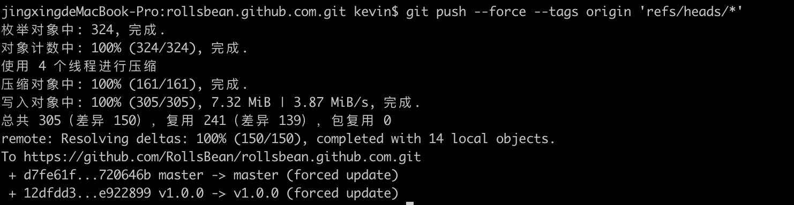

* content
{:toc}

GIT 修改已提交的邮箱和作者
<!-- more -->

## 背景

有时候新克隆下来的项目可能会忘记设置作者邮箱导致使用了全局的配置，这时候我们就需要修改掉邮箱地址。

具体的操作步骤如下。

## 解决

### 一、git clone --bare

在你本地创建一个临时目录，使用如下命令将代码克隆到本地。
```shell script
git clone --bare {your repo.git}
```


### 二、执行shell修改已提交的作者和邮箱

cd 到你的git目录下

```shell script
cd your-repo.git
```

执行如下脚本修改你想要修改的作者和邮箱，执行前先替换掉如下的参数，然后复制到控制台，回车。

* OLD_EMAIL：你想要修改掉的邮箱
* CORRECT_EMAIL：正确的邮箱
* CORRECT_NAME：正确的作者名

```shell script
#!/bin/sh

git filter-branch --env-filter '
OLD_EMAIL="your-old-email@example.com"
CORRECT_NAME="Your Correct Name"
CORRECT_EMAIL="your-correct-email@example.com"
if [ "$GIT_COMMITTER_EMAIL" = "$OLD_EMAIL" ]
then
    export GIT_COMMITTER_NAME="$CORRECT_NAME"
    export GIT_COMMITTER_EMAIL="$CORRECT_EMAIL"
fi
if [ "$GIT_AUTHOR_EMAIL" = "$OLD_EMAIL" ]
then
    export GIT_AUTHOR_NAME="$CORRECT_NAME"
    export GIT_AUTHOR_EMAIL="$CORRECT_EMAIL"
fi
' --tag-name-filter cat -- --branches --tags
```


### 三、提交修改到远程仓库

前面的截图可以看到如下几个Ref被重写了。

```shell script
Rewrite d7fe61fafff0a83f8b0edfe91b99e0fee6dc6563 (83/90) (3 seconds passed, remaining 0 predicted)
Ref 'refs/heads/master' was rewritten
Ref 'refs/tags/v1.0.0' was rewritten
```

将修改推到远端，这时候可能会弹出git安全提示，需要你输入电脑的开机密码（不是git密码）。

```shell script
git push --force --tags origin 'refs/heads/*'
```



## 参考

详细可以看油管： [https://www.youtube.com/watch?v=3LIr70uVZ_Q](https://www.youtube.com/watch?v=3LIr70uVZ_Q) 视频教程。
