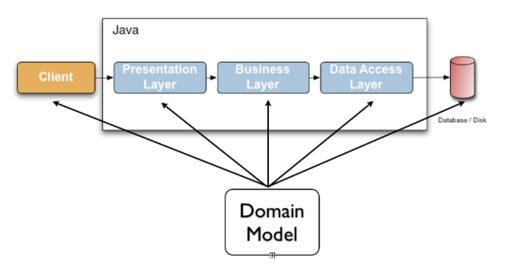

* content
  {:toc}
  
JSR-303 是 JAVA EE 6 中的一项子规范，叫做 Bean Validation，官方参考实现是Hibernate Validator。
它定义了用于JavaBean验证的元数据模型和API。本节将介绍在 Springboot 中使用 JSR-303 进行校验参数。
<!-- more -->

## JSR-303 介绍

数据校验是任何一个应用程序都会用到的功能,无论是显示层还是持久层. 通常,相同的校验逻辑
会分散在各个层中, 这样,不仅浪费了时间还会导致错误的发生(译注: 重复代码). 为了避免重
复, 开发人员经常会把这些校验逻辑直接写在领域模型里面, 但是这样又把领域模型代码和校验
代码混杂在了一起, 而这些校验逻辑更应该是描述领域模型的元数据.

JSR 303 - Bean Validation - 为实体验证定义了元数据模型和API. 默认的元数据模型是通过
Annotations来描述的,但是也可以使用XML来重载或者扩展. Bean Validation API 并不局限于应
用程序的某一层或者哪种编程模型, 例如,如图所示, Bean Validation 可以被用在任何一层, 或
者是像类似Swing的富客户端程序中.



## 一般项目使用

引入 maven 依赖

```xml
<dependency>
 <groupId>org.hibernate</groupId>
 <artifactId>hibernate-validator</artifactId>
 <version>6.1.7.Final</version>
</dependency>
```
定义 bean 并使用 JSR-303 中的注解
```java
import javax.validation.constranits.NotNull;
public class Order {
  @NotNull
  private String name;

  private int id;
}
```

执行校验
```java
test () {
  Validator validator = new Validator();
  Order order = new Order("aaa", 3)
  validator.validate(order);
}
```

## Springboot 中使用 JSR-303

Springboot 中已经引入了 hibernate-validator 包，并且 Springboot 也对 JSR-303 做了兼容，可以直接使用注解进行字段校验，无需手动校验。

不同的接口可能使用了相同的 bean，校验时对于不同的接口要校验的字段和内容可能也不一样，这时，我们就可以定义多个校验组来解决这个问题。如下代码所示：

```java
public class OrderParams {
    
    private String content;
    @NotBlank(groups = SaveCheck.class)
    private String name;
    @NotBlank(groups = GetByIdCheck.class, message= "不能为空")
    private String id;
    
    // 查询时的参数校验
    public interface GetByIdCheck {}
    // 保存时的参数校验
    public interface SaveCheck {}
  
}
```

groups 中可以定义多个组，比如 *@NotBlank(groups = { SaveCheck.class, GetByIdCheck.class })*

在 controller 中使用：

```java
@PostMapping("/save")
public Bean save(@RequestBody() @Validated( {OrderParams.SaveCheck.class} ) OrderParams orderParams) {
    // do something...
}
```

`@Validated` 中可以使用多个 group，用逗号分割即可。

### 自定义参数校验

如果要校验传入的参数是否是 JSON 类型或其他 JSR 中没有提供的校验，我们就需要编写自定义校验。

#### 自定义注解 

自定义注解 @IsJson

```java
import java.lang.annotation.Documented;
import java.lang.annotation.ElementType;
import java.lang.annotation.Retention;
import java.lang.annotation.RetentionPolicy;
import java.lang.annotation.Target;

@Target({ElementType.METHOD, ElementType.FIELD, ElementType.TYPE_USE, ElementType.ANNOTATION_TYPE, ElementType.CONSTRUCTOR, ElementType.PARAMETER})
@Retention(RetentionPolicy.RUNTIME)
@Documented
@Constraint(validateBy = { IsJsonConstraintValidator.class })
public @interface IsJson {

    String message() default "不是合法的 JSON 字符串";
    
    Class<?>[] groups() default {};
    
    Class<? extends Payload>[] payload() default {};
}
```

#### 自定义处理器

```java
import com.alibaba.fastjson.JSONValidator;
import javax.validation.ConstraintValidator;
import javax.validation.ConstraintValidatorContext;

public class IsJsonConstraintValidator implements ConstraintValidator<IsJson, String> {
    
    @Override
    public boolean isValid(String s, ConstraintValidatorContext constraintValidatorContext) {
        return s != null && isJson(s);
    }
    
    public static boolean isJson(String jsonString) {
        boolean isJson;
        try {
            JSONValidator validator = JSONValidator.from(jsonString);
            isJson = validator.validate();
        } catch (Exception e) {
            isJson = false;
        }
    }
}
```

#### 在 bean 中使用这个注解

```java
    @IsJson(groups = SaveCheck.class)
    private String content;
```