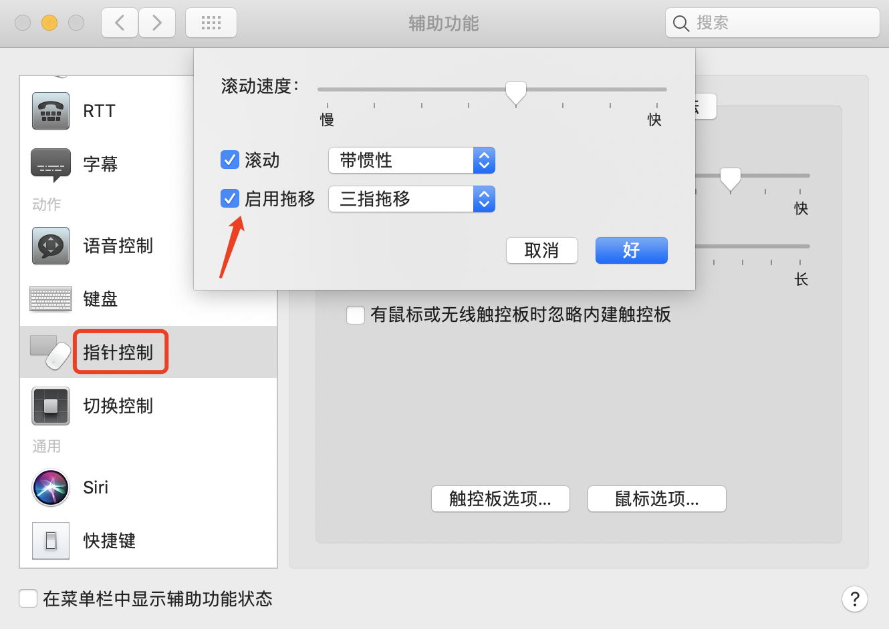
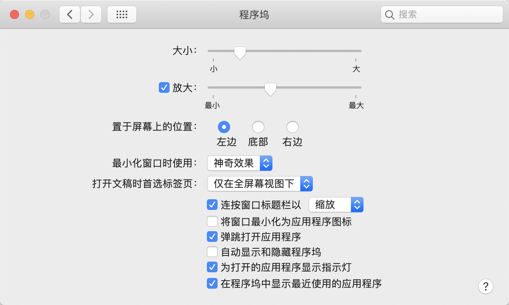
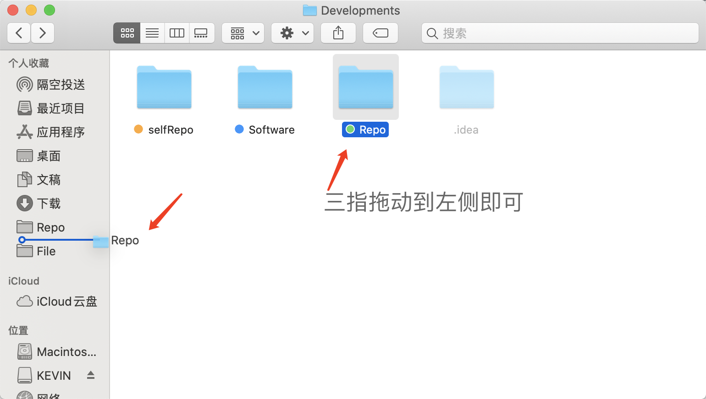
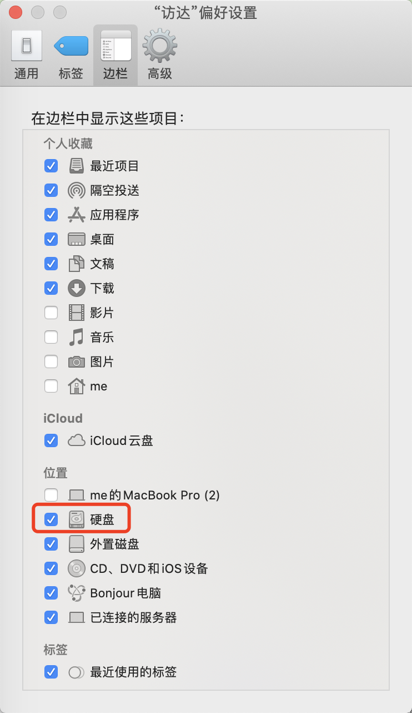

* content
{:toc}

拿到一台新 mac 之后的一些常用配置。

<!-- more -->

# 修改配置


## 修改触控板配置

系统参数设置 -> 触控板


### 设置三指拖动

1. 系统偏好设置 -> 辅助功能
   


2. 指针控制 -> 启用拖移（三指拖移）



## 修改程序坞配置

系统偏好设置 -> 程序坞



## 修改访达

修改访达配置

### 访达快捷栏修改



### 访达显示磁盘

访达 -> 偏好设置 -> 边栏 -> 勾选硬盘



# 开发环境配置

## bash 解释器

默认配置文件是 `~/.bash_profile`

```shell
cd ~
```

创建文件 `.bash_profile` 文件

```shell
touch .bash_profile
```

编辑文件，例如，配置 JDK 和 Maven 的环境变量：

```shell
export M3_HOME=/Users/me/Desktop/Developments/Software/apache-maven-3.8.1
export JAVA_HOME=/Library/Java/JavaVirtualMachines/jdk1.8.0_291.jdk/Contents/Home
export PATH=$M3_HOME/bin:$JAVA_HOME/bin:$PATH
```

使环境变量配置生效

```shell
source .bash_profile
```

## zsh 解释器

默认环境变量配置文件是 `~/.zshrc`，和 bash 解释器一样，需要创建文件并 source。


